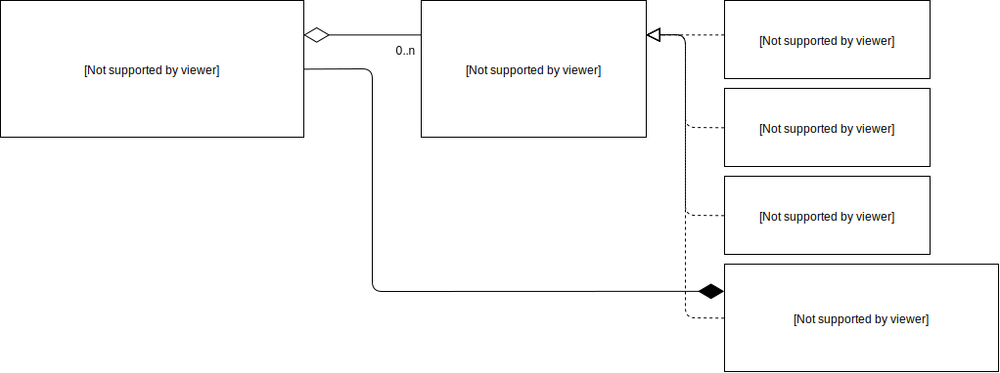
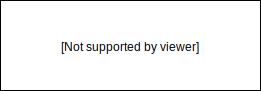
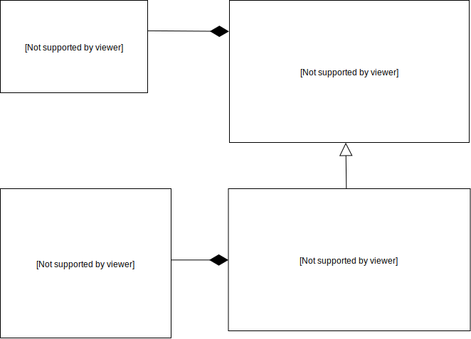

# Sheets

Command-line tool for work with spreadsheets. Implemented in C++. Done as a homework project for the course on Object-Oriented Programming at SU "Kliment Ohridski" FMI.

## Usage

### Prerequisites

- **CMake**: version 3.13 or higher

### Building the project

Run these commands while in the project directory:

```bash
cmake .
make
```

After that a **Cli** executable should be available in the src/Cli project folder.

## General Architecture

The project is separated in to 3 main modules:

1. **Core** - Table related functionality such as the editing cells, calculating formulas etc.




2. **Serialization** - Logic for serialization and deserialization of tables.



3. **Cli** - Command-line User Interface related functionality.




### Third-party libraries used

- Catch 2 Testing framework - [Go to Github page](https://github.com/catchorg/catch2)
